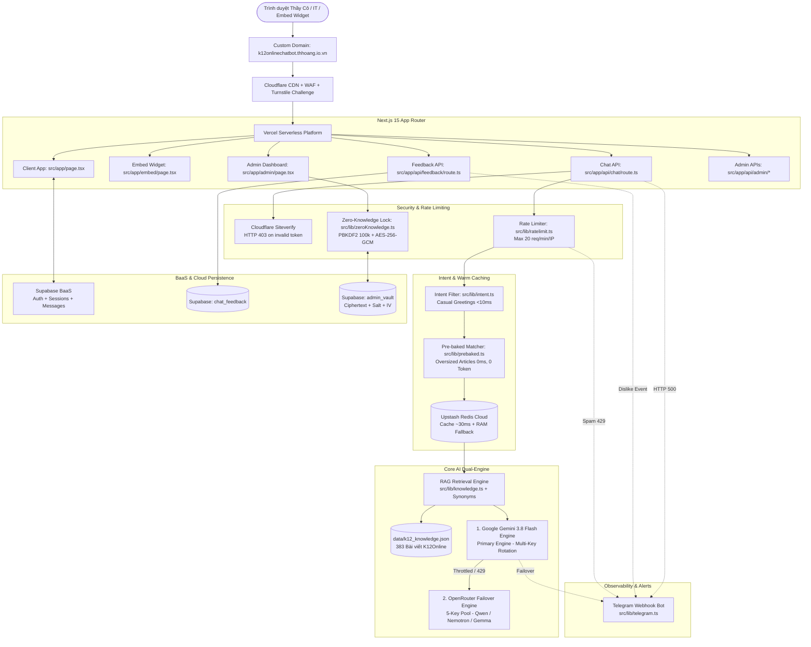

# 🛠️ KIẾN TRÚC CÔNG NGHỆ (TECHSTACK) - K12ONLINE CHATBOT

Dự án được xây dựng dựa trên tiêu chuẩn kiến trúc hiện đại: **Full-Stack Serverless + Edge WAF Protection + Dual-Engine AI + Pre-baked Warm Cache + Multi-Layer Distributed Caching**.



---

## 1. Giao diện & Trải nghiệm Người dùng (Frontend)
- **Next.js 15 (App Router):** Sử dụng React 19 Client Components với kiến trúc tối ưu hóa render thời gian thực.
- **Server-Sent Events (SSE) Streaming:** Truyền dữ liệu văn bản theo từng cụm (chunks) thời gian thực, có hiệu ứng typing mượt mà (15ms/từ).
- **Bộ Nhận diện Cuộn Thông minh (Smart Scroll-Intent):** Tự động phát hiện khi người dùng cuộn lên (>100px) để tạm dừng auto-scroll khi AI đang stream; hiển thị nút nổi *"Xuống mới nhất ↓"* và bảo vệ trạng thái hội thoại không bị ghi đè khi người dùng chuyển qua lại các tab trình duyệt.
- **Thẻ Gợi Ý Ngữ Cảnh (Contextual Follow-up Cards):** Gợi ý 2–3 câu hỏi tiếp theo dựa trên nội dung câu trả lời, thiết kế dạng thẻ độc lập có đệm đáy chống che khuất nút gửi.
- **Đánh giá Hài lòng (Like / Dislike):** Nút Like/Dislike trực tiếp dưới mỗi bong bóng tin nhắn AI kèm modal thu thập lý do chuyên sâu và bình luận cải tiến.
- **Xuất Lịch sử Trò chuyện (Export Chat Modal):** Tùy chọn xuất ra Markdown (`.md`), Plain Text (`.txt`) và In trực tiếp / Lưu PDF chuẩn in ấn (`@media print`).
- **Tailwind CSS & Dark Mode:** Thiết kế giao diện hiện đại, chuẩn chỉnh cho cả Mobile và Desktop với Dark Mode thân thiện cho mắt giáo viên.
- **React Markdown & Remark GFM:** Kết xuất đầy đủ bảng biểu Markdown, danh sách số, code block và đường link trích dẫn `.html` dẫn thẳng tới cổng Viettel.

---

## 2. Tầng Bảo mật & Phòng thủ Đa lớp (Security & Protection)
- **Cloudflare Turnstile (Dual-Layer):**
  - *Client:* Tự động xác thực thông minh trong nền, không làm phiền người dùng.
  - *Server:* Xác minh token qua endpoint Cloudflare Siteverify. Trả về mã `403 Forbidden` đối với mọi yêu cầu không hợp lệ hoặc cố tình gọi thẳng API bằng bot.
- **Giới hạn Kích thước Payload:** Khống chế câu hỏi tối đa **1.500 ký tự** nhằm triệt tiêu các cuộc tấn công flood token vào LLM.
- **Phân luồng Tần suất theo IP (Rate Limiting):** Tích hợp kiểm soát tốc độ qua Upstash Redis, giới hạn tối đa **20 câu hỏi / phút / IP**, trả về mã `429 Too Many Requests`.

---

## 3. Tầng Bộ nhớ Đệm Đa cấp (Multi-Layer Caching)
- **Cơ chế Pre-baked Warm Cache (Soạn sẵn cho bài quá khổ):**
  - Xử lý bài viết cẩm nang khổng lồ (bài `#255 Thư viện số` dài 67.600 ký tự) bằng câu trả lời mẫu chi tiết 7 phân hệ.
  - Thuật toán so khớp tiếng Việt 3 tầng (`src/lib/prebaked.ts`) nhận diện trong < 2ms, phản hồi **0ms latency, tiêu tốn 0 token AI**.
- **Upstash Redis (Serverless Cloud Cache):**
  - Tự động chuẩn hóa câu hỏi và lưu trữ câu trả lời trong vòng 7 ngày.
  - Phản hồi siêu tốc chỉ trong **~30ms** cho các câu hỏi trùng lặp, chia sẻ đồng thời cho toàn bộ người dùng và tiết kiệm 100% token AI.
- **In-Memory RAM Cache:** Cơ chế dự phòng nội bộ tự động kích hoạt nếu kết nối Redis tạm thời gián đoạn.
- **Client-Side Cache:** Lưu trữ trực tiếp trên trình duyệt, phản hồi trong **0.01 giây** khi hỏi lại câu hỏi trong cùng phiên.

---

## 4. Bộ Não Trí Tuệ Nhân Tạo Động Cơ Kép (Dual-Engine AI Architecture)

### 4.1. Động cơ chính: Google Gemini 3.8 Flash (`src/lib/gemini.ts`)
- **Model:** `gemini-3.8-flash` với hạn ngạch context window lớn và đầu ra mở rộng `maxOutputTokens: 8192`.
- **Cơ chế xoay vòng Key (Multi-Key Rotation):** Nạp danh sách khóa từ `GEMINI_API_KEYS`, phân phối Round-Robin tự động.
- **Chuyển tiếp Rate Limit Headers:** Bóc tách và forward các header `x-ratelimit-*` từ Google về client và log server console để theo dõi hạn ngạch thực tế.

### 4.2. Động cơ dự phòng: OpenRouter Multi-Key Pool (`src/lib/openrouter.ts`)
- **Bể xoay vòng:** Nạp 5 API Keys từ `OPENROUTER_API_KEYS`.
- **Fast Failover:** Tự động bắt lỗi 429 hoặc quá tải upstream pool để chuyển ngay lập tức sang mô hình dự phòng (`Qwen 3.8 27B` ➔ `NVIDIA Nemotron 3 Ultra 550B` ➔ `Google Gemma 4 31B`) trong **0.1 giây**, đồng thời bắn cảnh báo Telegram ngầm về máy quản trị viên.

---

## 5. Cơ sở Dữ liệu & Tri thức (Knowledge Base & BaaS)
- **Kho tri thức 383 bài viết nghiệp vụ:** Lưu trữ dưới dạng JSON siêu tốc (`data/k12_knowledge.json` ~1.18 MB), được tự động đồng bộ và biên dịch từ `data/articles/` qua lệnh `prebuild` (`scripts/build_knowledge_json.js`).
- **Từ điển đồng nghĩa Tiếng Việt (Synonym Mapping):** `src/lib/synonyms.ts` ánh xạ hơn 50+ cặp thuật ngữ giáo dục phổ biến giúp tìm kiếm RAG chính xác dù người dùng dùng từ địa phương hoặc từ lóng.
- **Trích xuất URL gốc chính xác:** Regex chuẩn hóa xử lý hoàn hảo ngắt dòng CRLF/LF, đảm bảo 100% bài viết trích dẫn đều có đuôi `.html` chi tiết.
- **Supabase BaaS:** Quản trị đăng nhập và lưu trữ các bảng:
  - `chat_sessions` & `chat_messages`: Lưu phiên và lịch sử hội thoại.
  - `chat_feedback`: Lưu đánh giá Like/Dislike, nguyên nhân và bình luận người dùng.
  - `admin_vault`: Lưu trữ bộ dữ liệu xác thực Zero-Knowledge (`ciphertext`, `salt`, `iv`, `hint`).

---

## 6. Kiến trúc Bảo mật Zero-Knowledge Admin (`/admin`)

Hệ thống quản trị được thiết kế theo nguyên lý **Zero-Knowledge Encryption** (`src/lib/zeroKnowledge.ts`), đảm bảo ngay cả khi Database của Supabase hoặc Server Vercel bị xâm nhập thì Hacker cũng không thể khôi phục được mật khẩu quản trị:

```
[Master Password]
       │
       ▼ (Client-side Web Crypto API)
PBKDF2 Derivation (100.000 iterations, SHA-256, 16-byte Crypto Salt)
       │
       ▼
[Derived 256-bit AES-GCM Key]
       │
       ▼
AES-256-GCM Encryption / Decryption (+ 12-byte IV + 128-bit Auth Tag)
       │
       ▼
Server chỉ lưu trữ: { ciphertext, salt, iv, hint }
```

- **PBKDF2 (100.000 vòng lặp):** Làm chậm tốc độ tính toán phần cứng có chủ đích; một cuộc tấn công brute-force 1 triệu mật khẩu sẽ tốn nhiều năm tính toán.
- **AES-256-GCM:** Sử dụng chuẩn mã hóa khóa đối xứng với **Authentication Tag**. Bất kỳ sự can thiệp sai lệch nào (dù chỉ 1 bit trong ciphertext) đều làm tag mismatch và hàm giải mã lập tức quăng lỗi.
- **Tách biệt hoàn toàn Client - Server:** Trình duyệt chỉ gửi ciphertext và salt lên server. Plaintext mật khẩu không bao giờ rời khỏi thiết bị của Quản trị viên.

---

## 7. Giám sát & Cảnh báo Tự động (Telegram Bot Observability)

Tích hợp Bot Telegram (`src/lib/telegram.ts`) với cơ chế gửi tin không đồng bộ (non-blocking async background) sử dụng `fetch` và `AbortController` timeout 4 giây, không làm ảnh hưởng đến độ trễ phản hồi của người dùng:

- **Cảnh báo Spam Rate Limit:** Khi 1 địa chỉ IP vượt quá 20 req/phút, thông báo Telegram gửi chi tiết: IP, URL, User-Agent.
- **Cảnh báo AI Failover:** Khi Google Gemini gặp sự cố (429, Quota, Timeout) và hệ thống tự động nhảy sang OpenRouter, bot sẽ báo động kèm lỗi chi tiết.
- **Cảnh báo Phản hồi Không hài lòng (Dislike):** Khi người dùng bấm nút Dislike, bot gửi câu hỏi của người dùng, lý do không hài lòng (Sai bước, link hỏng, khó hiểu...) và góp ý bổ sung để quản trị viên kịp thời cập nhật tri thức.
- **Cảnh báo Lỗi Hệ thống 500:** Báo động ngay lập tức khi xuất hiện lỗi nghiêm trọng chưa được xử lý.

---

## 8. Kiến trúc Widget nhúng Website Trường học (Embeddable Widget)

- **Mã nguồn:** `public/widget.js` & `src/app/embed/page.tsx`
- **Cơ chế hoạt động:**
  - Script độc lập siêu nhẹ (~3KB), không phụ thuộc thư viện bên ngoài (Zero-dependency Vanilla JS).
  - Tự động tiêm một nút tròn nổi ở góc phải màn hình (`bottom: 24px; right: 24px; z-index: 999999`) và một cửa sổ `iframe` trỏ đến `https://k12onlinechatbot.thhoang.io.vn/embed`.
  - Hỗ trợ đóng mở với hiệu ứng chuyển động mượt mà, tự động co giãn full-screen trên màn hình điện thoại di động (<640px).
- **Cấu hình CSP (Cross-Origin Policy):** `next.config.mjs` thiết lập `Content-Security-Policy: frame-ancestors *` và `X-Frame-Options: ALLOWALL` riêng cho route `/embed` để mọi tên miền trường học đều có thể nhúng hợp lệ.

---

## 9. Hệ thống Kiểm thử Tự động Toàn diện (Automation Testing Architecture)

- **Mã nguồn:** Thư mục `tests/` và lệnh `npm test` (`tests/run_all_tests.js`).
- **Triết lý thiết kế:**
  - **Zero-Dependency Native Execution:** Tận dụng Web Crypto API có sẵn trong Node.js và Fetch API, không cần cài đặt các framework cồng kềnh giúp tốc độ chạy siêu tốc (<35s cho toàn bộ 39 Test Cases).
  - **Phân tầng đa cấp:**
    * *Unit Testing (`tests/unit/`):* Thẩm định toàn vẹn kho 383 bài viết nghiệp vụ, độ phủ từ điển đồng nghĩa, logic nhận diện Intent (<10ms), so khớp Pre-baked cache cho bài cẩm nang lớn, an toàn mật mã Web Crypto PBKDF2 100.000 iterations + AES-256-GCM, chống can thiệp 1 bit ciphertext (Tamper Resistance), và bộ đếm rate limit.
    * *Integration Testing (`tests/integration/`):* Kiểm thử HTTP Live Endpoints (`/api/chat` chặn 403 khi thiếu Turnstile, `/api/feedback` ghi nhận like/dislike, `/api/admin/*` kiểm soát whitelist email, `/embed` & `widget.js` kiểm tra tiêu đề CSP frame-ancestors *).
  - **Tiêu chuẩn tài liệu:** Tuân thủ chuẩn **IEEE 829 & ISTQB** (`tests/test_plan.md`, `tests/test_cases.md`), tự động đo lường độ trễ (latency benchmarks) và kết xuất báo cáo chuẩn Markdown (`tests/test_report.md`) đạt **100.0% Pass Rate**.


