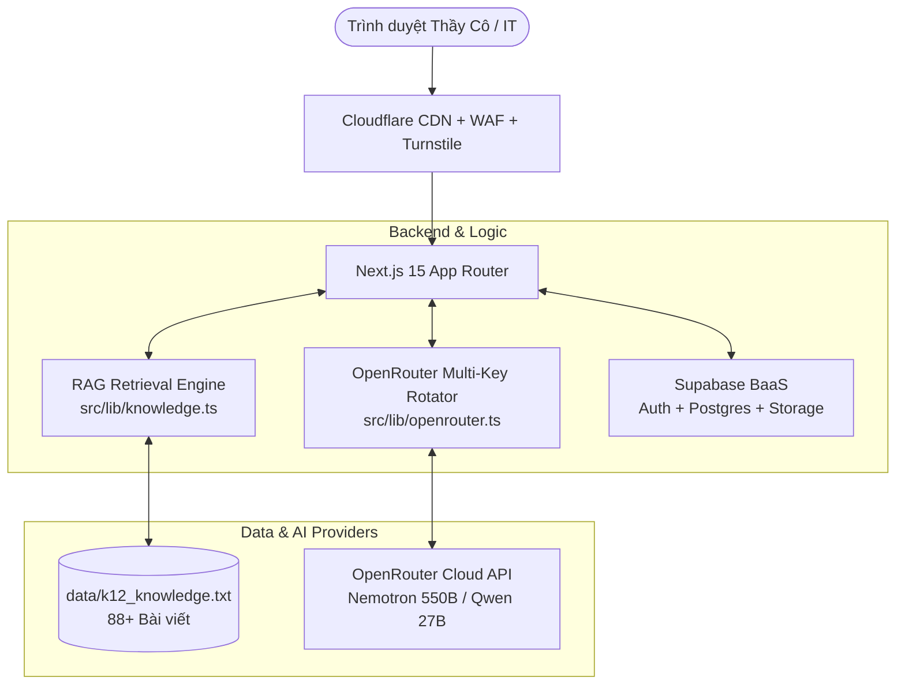

# 🛠️ KIẾN TRÚC CÔNG NGHỆ (TECHSTACK) - K12ONLINE CHATBOT

Dự án được xây dựng dựa trên tiêu chuẩn kiến trúc hiện đại nhất hiện nay: **Full-Stack Serverless + Edge Protection + BaaS**.

---

## 1. Frontend & Framework
- **Next.js 15 (App Router):** Tối ưu hóa tốc độ tải trang (Server-Side Rendering & Client Components).
- **React 19 & TypeScript:** Đảm bảo tính chặt chẽ về mặt kiểu dữ liệu và dễ bảo trì.
- **Tailwind CSS:** Thiết kế giao diện hiện đại, chuẩn Dark Mode thân thiện với mắt khi làm việc ban đêm.
- **Lucide React:** Bộ icon giao diện sắc nét, chuẩn thiết kế.

---

## 2. Backend & Dịch vụ Nền tảng (BaaS)
- **Next.js API Routes:** Xử lý logic API chat, bóc tách câu hỏi và gọi OpenRouter an toàn từ phía Server (giấu kín API Key).
- **Supabase (PostgreSQL BaaS):** 
  - Quản lý xác thực người dùng (Supabase Auth).
  - Khả năng mở rộng lưu trữ Vector (`pgvector`) cho RAG khi mở rộng quy mô lớn.
  - Phân quyền cấp độ dòng (Row Level Security - RLS).

---

## 3. An ninh & Mạng (Security & CDN)
- **Cloudflare WAF / CDN:** Bảo vệ máy chủ khỏi tấn công từ chối dịch vụ (DDoS) và phân phối tĩnh tốc độ cao.
- **Cloudflare Turnstile:** Xác minh người dùng thông minh, chống bot phá hoại mà không gây khó chịu cho thầy cô bằng các câu đố Captcha phức tạp.

---

## 4. Bộ Não Trí Tuệ Nhân Tạo (AI Engine)
- **OpenRouter API:** Trung tâm tích hợp mô hình ngôn ngữ lớn (LLM).
- **Kỹ năng Xoay Key (Multi-Key Rotation):** Tận dụng nhiều tài khoản API miễn phí chạy luân phiên Round-Robin để nhân gấp nhiều lần hạn mức giới hạn (Rate Limits).
- **Mô hình AI chủ đạo:**
  - `nvidia/nemotron-3-ultra-550b-a55b:free` (Mô hình suy luận lớn 550B tham số, đọc hiểu tài liệu sâu).
  - `qwen/qwen3.8-27b:free` (Mô hình xử lý văn phong tiếng Việt tự nhiên và cực nhanh).
