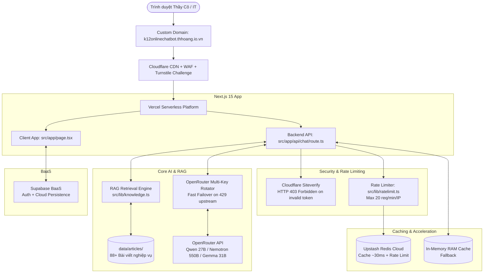

# 🛠️ KIẾN TRÚC CÔNG NGHỆ (TECHSTACK) - K12ONLINE CHATBOT

Dự án được xây dựng dựa trên tiêu chuẩn kiến trúc hiện đại: **Full-Stack Serverless + Edge WAF Protection + In-Memory Distributed Caching + Multi-LLM Failover**.

---

## 1. Giao diện & Trải nghiệm Người dùng (Frontend)
- **Next.js 15 (App Router):** Sử dụng React 19 Client Components tối ưu hóa khả năng phản hồi tức thời.
- **Tailwind CSS & Tailwind Merge:** Hệ thống thiết kế hiện đại, hỗ trợ Dark Mode chuẩn mực bảo vệ mắt.
- **Lucide React:** Bộ icon giao diện tối giản, sắc nét.
- **React Markdown & Remark GFM:** Trình kết xuất nội dung Markdown chuẩn mực với bảng biểu, danh sách và đường dẫn trích dẫn.

---

## 2. Tầng Bảo mật & Phòng thủ (Security & Protection)
- **Cloudflare Turnstile (Dual-Layer):**
  - *Client:* Tự động xác thực thông minh, không gây phiền toái bằng các câu đố Captcha phức tạp.
  - *Server:* Xác minh token qua endpoint `https://challenges.cloudflare.com/turnstile/v0/siteverify`. Từ chối thẳng tay mã `403 Forbidden` đối với các yêu cầu không có token hợp lệ.
- **Giới hạn Kích thước Payload:** Khống chế câu hỏi tối đa **1.500 ký tự** nhằm triệt tiêu các cuộc tấn công flood token vào LLM.
- **Phân luồng Tần suất theo IP (Rate Limiting):** Tích hợp kiểm soát tốc độ qua Upstash Redis, giới hạn tối đa **20 câu hỏi / phút / IP**, trả về mã `429 Too Many Requests`.

---

## 3. Tầng Bộ nhớ Đệm Phân tán (Distributed Caching)
- **Upstash Redis (Serverless Cloud):**
  - Tự động chuẩn hóa câu hỏi và lưu trữ câu trả lời trong vòng 7 ngày.
  - Phản hồi siêu tốc chỉ trong **~30ms** cho các câu hỏi trùng lặp, chia sẻ đồng thời cho toàn bộ người dùng và tiết kiệm 100% token AI.
- **In-Memory RAM Cache:** Cơ chế dự phòng nội bộ tự động kích hoạt nếu kết nối Redis tạm thời gián đoạn.
- **Client-Side Cache:** Lưu trữ trực tiếp trên trình duyệt, phản hồi trong **0.01 giây** khi hỏi lại câu hỏi trong cùng phiên.

---

## 4. Bộ Não Trí Tuệ Nhân Tạo & Xoay Vòng Khóa (AI Engine)
- **OpenRouter Multi-Key Rotator:**
  - Nhận nhiều khóa API phân cách bằng dấu phẩy từ biến `OPENROUTER_API_KEYS`.
  - Phân phối yêu cầu theo thuật toán Round-Robin.
- **Cơ chế Chuyển vùng Nhanh (Fast Failover):**
  - Mô hình ưu tiên: `qwen/qwen3.8-27b:free` (văn phong tiếng Việt chuẩn, xử lý nhanh).
  - Khi phát hiện mã 429 từ nguồn dùng chung upstream pool, hệ thống lập tức chuyển sang mô hình dự phòng `nvidia/nemotron-3-ultra-550b-a55b:free` hoặc `google/gemma-4-31b-it:free` trong vòng **0.1 giây**.

---

## 5. Cơ sở Dữ liệu & Tri thức (Knowledge & BaaS)
- **File-based RAG:** 88+ tài liệu nghiệp vụ K12Online được lưu trữ dưới dạng file văn bản độc lập trong `data/articles/`.
- **Supabase BaaS:** Quản lý tài khoản người dùng và sẵn sàng kích hoạt lưu trữ đám mây.
