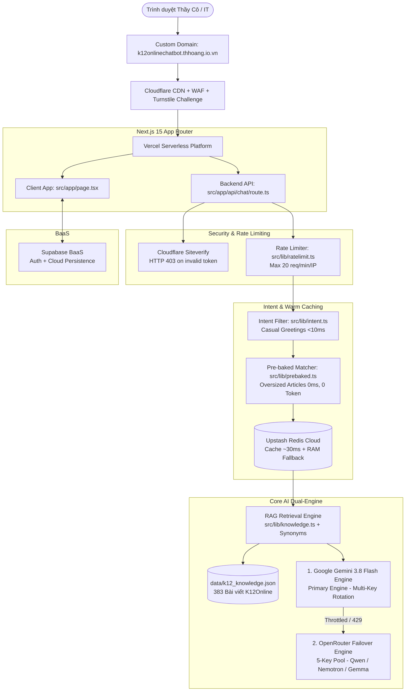

# 🛠️ KIẾN TRÚC CÔNG NGHỆ (TECHSTACK) - K12ONLINE CHATBOT

Dự án được xây dựng dựa trên tiêu chuẩn kiến trúc hiện đại: **Full-Stack Serverless + Edge WAF Protection + Dual-Engine AI + Pre-baked Warm Cache + Multi-Layer Distributed Caching**.

---

## 1. Giao diện & Trải nghiệm Người dùng (Frontend)
- **Next.js 15 (App Router):** Sử dụng React 19 Client Components với kiến trúc tối ưu hóa render thời gian thực.
- **Server-Sent Events (SSE) Streaming:** Truyền dữ liệu văn bản theo từng cụm (chunks) thời gian thực, có hiệu ứng typing mượt mà (15ms/từ).
- **Thẻ Gợi Ý Ngữ Cảnh (Contextual Follow-up Cards):** Gợi ý 2–3 câu hỏi tiếp theo dựa trên nội dung câu trả lời, thiết kế dạng thẻ độc lập có đệm đáy chống che khuất nút gửi.
- **Tailwind CSS:** Thiết kế giao diện hiện đại, chuẩn chỉnh cho cả Mobile và Desktop với Dark Mode thân thiện cho mắt giáo viên.
- **React Markdown & Remark GFM:** Kết xuất đầy đủ bảng biểu Markdown, danh sách số, code block và đường link trích dẫn `.html` dẫn thẳng tới cổng Viettel.

---

## 2. Tầng Bảo mật & Phòng thủ Đa lớp (Security & Protection)
- **Cloudflare Turnstile (Dual-Layer):**
  - *Client:* Tự động xác thực thông minh trong nền, không làm phiền người dùng.
  - *Server:* Xác minh token qua endpoint Cloudflare Siteverify. Trả về mã `403 Forbidden` đối với mọi yêu cầu không hợp lệ hoặc cố tình gọi thẳng API bằng bot.
- **Giới hạn Kích thước Payload:** Khống chế câu hỏi tối đa **1.500 ký tự** nhằm triệt tiêu các cuộc tấn công flood token vào LLM.
- **Phân luồng Tần suất theo IP (Rate Limiting):** Tích hợp kiểm soát tốc độ qua Upstash Redis, giới hạn tối đa **20 câu hỏi / phút / IP**, trả về mã `429 Too Many Requests`.

---

## 3. Tầng Bộ nhớ Đệm Đa cấp (Multi-Layer Caching)
- **Cơ chế Pre-baked Warm Cache (Soạn sẵn cho bài quá khổ):**
  - Xử lý bài viết cẩm nang khổng lồ (bài `#255 Thư viện số` dài 67.600 ký tự) bằng câu trả lời mẫu chi tiết 7 phân hệ.
  - Thuật toán so khớp tiếng Việt 3 tầng (`src/lib/prebaked.ts`) nhận diện trong < 2ms, phản hồi **0ms latency, tiêu tốn 0 token AI**.
- **Upstash Redis (Serverless Cloud Cache):**
  - Tự động chuẩn hóa câu hỏi và lưu trữ câu trả lời trong vòng 7 ngày.
  - Phản hồi siêu tốc chỉ trong **~30ms** cho các câu hỏi trùng lặp, chia sẻ đồng thời cho toàn bộ người dùng và tiết kiệm 100% token AI.
- **In-Memory RAM Cache:** Cơ chế dự phòng nội bộ tự động kích hoạt nếu kết nối Redis tạm thời gián đoạn.
- **Client-Side Cache:** Lưu trữ trực tiếp trên trình duyệt, phản hồi trong **0.01 giây** khi hỏi lại câu hỏi trong cùng phiên.

---

## 4. Bộ Não Trí Tuệ Nhân Tạo Động Cơ Kép (Dual-Engine AI Architecture)

### 4.1. Động cơ chính: Google Gemini 3.8 Flash (`src/lib/gemini.ts`)
- **Model:** `gemini-3.8-flash` với hạn ngạch context window lớn và đầu ra mở rộng `maxOutputTokens: 8192`.
- **Cơ chế xoay vòng Key (Multi-Key Rotation):** Nạp danh sách khóa từ `GEMINI_API_KEYS`, phân phối Round-Robin tự động.
- **Chuyển tiếp Rate Limit Headers:** Bóc tách và forward các header `x-ratelimit-*` từ Google về client và log server console để theo dõi hạn ngạch thực tế.

### 4.2. Động cơ dự phòng: OpenRouter Multi-Key Pool (`src/lib/openrouter.ts`)
- **Bể xoay vòng:** Nạp 5 API Keys từ `OPENROUTER_API_KEYS`.
- **Fast Failover:** Tự động bắt lỗi 429 hoặc quá tải upstream pool để chuyển ngay lập tức sang mô hình dự phòng (`Qwen 3.8 27B` ➔ `NVIDIA Nemotron 3 Ultra 550B` ➔ `Google Gemma 4 31B`) trong **0.1 giây**.

---

## 5. Cơ sở Dữ liệu & Tri thức (Knowledge Base & BaaS)
- **Kho tri thức 383 bài viết nghiệp vụ:** Lưu trữ dưới dạng JSON siêu tốc (`data/k12_knowledge.json` ~1.18 MB), được tự động đồng bộ và biên dịch từ `data/articles/` qua lệnh `prebuild` (`scripts/build_knowledge_json.js`).
- **Từ điển đồng nghĩa Tiếng Việt (Synonym Mapping):** `src/lib/synonyms.ts` ánh xạ hơn 50+ cặp thuật ngữ giáo dục phổ biến giúp tìm kiếm RAG chính xác dù người dùng dùng từ địa phương hoặc từ lóng.
- **Trích xuất URL gốc chính xác:** Regex chuẩn hóa xử lý hoàn hảo ngắt dòng CRLF/LF, đảm bảo 100% bài viết trích dẫn đều có đuôi `.html` chi tiết.
- **Supabase BaaS:** Quản lý phiên đăng nhập và đồng bộ lịch sử hội thoại lên PostgreSQL.
